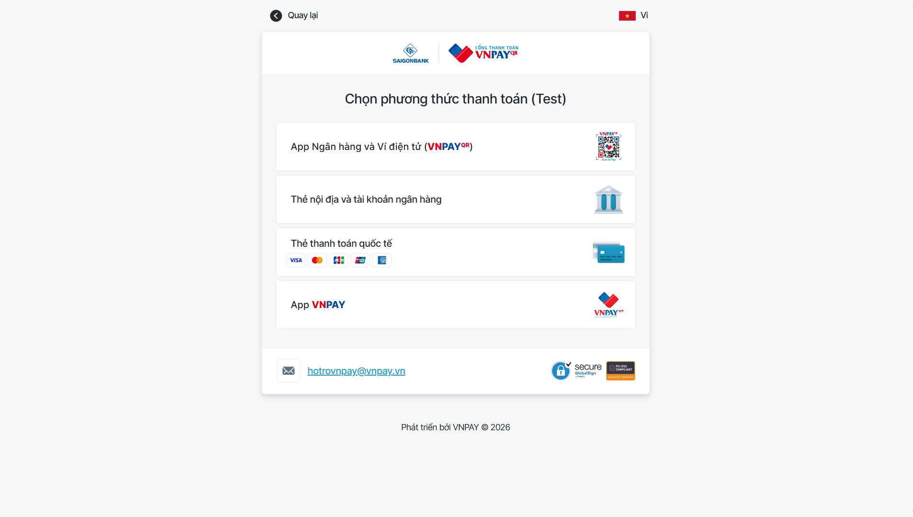

  

  # 🏠 GIA DỤNG TMT - MODERN E-COMMERCE PLATFORM

  **Hệ thống Thương mại điện tử chuyên nghiệp, tích hợp Real-time, AI Chatbot & Thanh toán VNPAY.**

  
  
  
  
  
  
  
  

  [🚀 **View Live Demo**](https://dogiadung-vwp8.onrender.com/)
  
  _(Backend API: [https://dogiadungtmt.onrender.com](https://dogiadungtmt.onrender.com))_

---

## 📖 Overview

**Gia Dụng TMT** không chỉ là một website bán hàng thông thường. Đây là một giải pháp Fullstack hoàn chỉnh mô phỏng quy trình vận hành thực tế của một doanh nghiệp thương mại điện tử. 

Hệ thống tập trung vào trải nghiệm người dùng mượt mà (**UX/UI**), khả năng quản trị thời gian thực (**Real-time Dashboard**) và tính bảo mật cao (**Security**).

---

## 🔥 Key Highlights

### 🛍️ Dành Cho Khách Hàng
* 🤖 **AI Smart Chatbot:** Tư vấn sản phẩm, giải đáp thắc mắc tự động 24/7.
* 💳 **Thanh Toán Đa Kênh:** Tích hợp cổng thanh toán **VNPAY** (ATM/QR Code) và COD.
* 🛒 **Real-time Cart & Order:** Cập nhật giỏ hàng và trạng thái đơn hàng tức thì.
* 🔐 **Bảo Mật Tài Khoản:** Đăng ký/Đăng nhập, **Quên mật khẩu (Email Token)**, Đổi Avatar, Quản lý hồ sơ.
* 📧 **Automated Emails:** Nhận email xác nhận đơn hàng và reset mật khẩu tự động.

### 🛡️ Dành Cho Quản Trị Viên
* ⚡ **Real-time Notification:** Hệ thống Socket.io báo chuông **"Ting ting"** ngay khi có đơn hàng mới.
* 📊 **Analytics Dashboard:** * Biểu đồ doanh thu trực quan (**Recharts**).
    * Thống kê Top sản phẩm, Top danh mục bán chạy.
* 📑 **Quản Lý Đơn Hàng Chuyên Sâu:**
    * Bộ lọc theo trạng thái, tìm kiếm thông minh.
    * **Xuất báo cáo doanh thu ra Excel (.xlsx)** chỉ với 1 click.
    * Xem chi tiết đơn hàng, in hóa đơn.
* 🔒 **System Security:** Tích hợp **Helmet** (Bảo vệ Header), **Rate Limiting** (Chống Spam/DDoS).

---

## 📸 Screenshots

| 🏠 Trang Chủ | 📊 Admin Dashboard |
|:---:|:---:|
|  |  |

| 💳 Thanh Toán VNPAY | 📑 Quản Lý Đơn Hàng & Xuất Excel |
|:---:|:---:|
|  |  |

---

## 🛠️ Tech Stack

| Category | Technology |
| --- | --- |
| **Frontend** | **React (Vite)**, TypeScript, TailwindCSS, Lucide React, Axios, Recharts |
| **Backend** | **Node.js**, Express.js, JWT, Bcryptjs, Multer, Nodemailer |
| **Database** | **MySQL 8.0** (Relational Database) |
| **Real-time** | **Socket.io** (WebSockets) |
| **Security** | Helmet, Express-Rate-Limit, Cors |
| **DevOps** | Docker, Docker Compose, Render Cloud |
| **Payment** | VNPAY SDK Integration |

---

## 🚀 Installation

Bạn có thể chạy dự án nhanh chóng bằng Docker hoặc cài đặt thủ công.

### Cách 1: Chạy bằng Docker

# 1. Clone dự án
git clone [https://github.com/username/dogiadung-main.git](https://github.com/username/dogiadung-main.git)
cd dogiadung-main

# 2. Tạo file .env trong thư mục server

# 3. Build và Run
Cách 2: Chạy Thủ công (Manual)
1. Setup Backend
cd server
npm install
# Cấu hình file .env
npm start
2. Setup Frontend
cd client
npm install
npm run dev

# --- DATABASE ---
DB_HOST=localhost
DB_USER=root
DB_PASSWORD=your_password
DB_NAME=dogiadung_db
DB_PORT=3306

# --- SERVER ---
PORT=8081
NODE_ENV=development
CLIENT_URL=http://localhost:5173

# --- EMAIL SERVICE ---
EMAIL_USER=your_email@gmail.com
EMAIL_PASS=your_app_password

# --- VNPAY PAYMENT ---
VNPAY_TMN_CODE=your_tmn_code
VNPAY_HASH_SECRET=your_secret_key
VNPAY_URL=[https://sandbox.vnpayment.vn/paymentv2/vpcpay.html](https://sandbox.vnpayment.vn/paymentv2/vpcpay.html)
VNPAY_RETURN_URL=http://localhost:5173/vnpay-return

👨‍💻 Tác Giả (Author)

Trương Minh Thành

Software Engineering Student @ Ton Duc Thang University (TDTU)

 <i>Project for educational purpose. © 2026 Gia Dụng TMT</i> 
