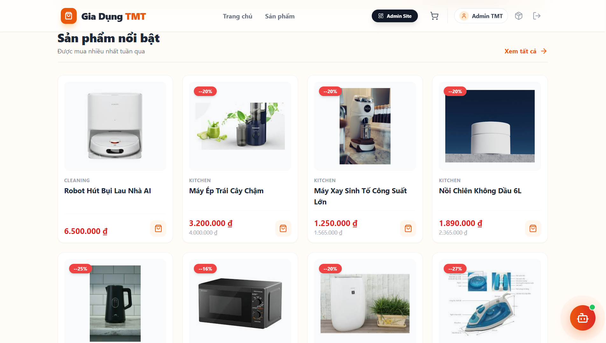
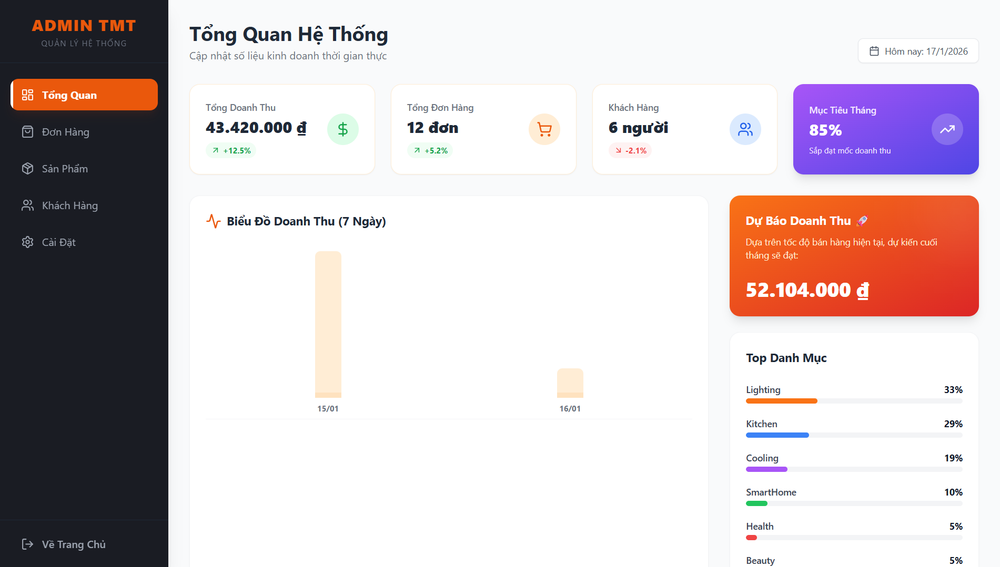
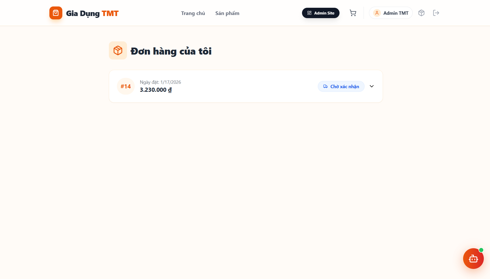

# 🏠 Gia Dụng TMT - E-commerce Platform


> **Website thương mại điện tử chuyên cung cấp các thiết bị gia dụng thông minh, tích hợp quản lý Admin Dashboard, Chatbot AI và gửi Email tự động.**

## 🌐

👉 **Live Website:** [https://dogiadung-vwp8.onrender.com/](https://dogiadung-vwp8.onrender.com/)  

---

### 1. Trang Chủ (Home Page)
Giao diện thân thiện, tìm kiếm và lọc sản phẩm dễ dàng.



### 2. Trang Quản Trị (Admin Dashboard)
Biểu đồ thống kê doanh thu và quản lý đơn hàng trực quan.



### 3. Lịch Sử & Giỏ Hàng
Quản lý đơn hàng cá nhân và xem lại lịch sử mua sắm.



---

## 🛠️ Công Nghệ Sử Dụng (Tech Stack)

### **Frontend (Client)**
* **Core:** ReactJS (Vite), TypeScript.
* **Styling:** TailwindCSS, Lucide React (Icons).
* **State Management:** React Context API.
* **HTTP Client:** Axios.
* **Features:** React Router DOM, React Hot Toast (Notifications).

### **Backend (Server)**
* **Runtime:** Node.js.
* **Framework:** Express.js.
* **Database:** MySQL (Aiven Cloud).
* **Authentication:** JWT (JSON Web Tokens) / Custom Auth Session.
* **Libraries:** * `bcryptjs` (Mã hóa mật khẩu).
    * `nodemailer` (Gửi email xác nhận đơn hàng).
    * `multer` (Upload hình ảnh sản phẩm).

---

## ✨ Key Features

### 👤 Dành cho Khách Hàng (User)
- [x] **Đăng ký / Đăng nhập:** Bảo mật thông tin người dùng.
- [x] **Tìm kiếm & Lọc:** Tìm sản phẩm theo tên, danh mục, mức giá.
- [x] **Giỏ hàng thông minh:** Thêm/sửa/xóa sản phẩm, tính tổng tiền tự động.
- [x] **Đặt hàng & Email:** Gửi email xác nhận đơn hàng tự động về hòm thư khách hàng.
- [x] **Chatbot AI:** Hỗ trợ tư vấn, tìm kiếm sản phẩm theo từ khóa (nồi, chảo, giá rẻ...).
- [x] **Đánh giá sản phẩm:** Cho phép upload ảnh review thực tế.

### 🛡️ Dành cho Quản Trị Viên (Admin)
- [x] **Dashboard Thống Kê:** Biểu đồ doanh thu tuần, top sản phẩm bán chạy, tổng đơn hàng (Real-time).
- [x] **Quản lý Sản Phẩm:** Thêm, Sửa, Xóa hình ảnh và thông tin sản phẩm.
- [x] **Quản lý Đơn Hàng:** Xem chi tiết đơn, cập nhật trạng thái (Đang giao, Đã hủy...).
- [x] **Bảo mật:** Trang Admin được bảo vệ, chỉ tài khoản Role Admin mới truy cập được.

---

## 🚀 Hướng Dẫn Cài Đặt (Local Development)

Nếu bạn muốn chạy dự án này trên máy cá nhân, hãy làm theo các bước sau:

### 1. Clone dự án
```bash
git clone [https://github.com/username/dogiadung-main.git](https://github.com/username/dogiadung-main.git)
cd dogiadung-main

### 2. Cài đặt & Chạy Backend
```bash
cd server
npm install
# Tạo file .env trong thư mục server (Xem mẫu bên dưới)
node index.js

### 3. Cài đặt & Chạy Frontend
```bash
# Mở terminal mới, quay lại thư mục gốc
cd .. 
npm install
# Tạo file .env trong thư mục gốc (Xem mẫu bên dưới)
npm run dev
###🔐 Cấu Hình Biến Môi Trường (.env)
```bash
### I. Backend (server/.env)
PORT=8081
DB_HOST=localhost (hoặc link Aiven Cloud)
DB_USER=root
DB_PASSWORD=your_password
DB_NAME=dogiadung_db
### II. Frontend (/.env)
VITE_API_URL=http://localhost:8081

# Cấu hình gửi mail
EMAIL_USER=your_email@gmail.com
EMAIL_PASS=your_app_password

👨‍💻 Tác Giả
Sinh viên: Trương Minh Thành

MSSV: 524H0032

Trường: Ton Duc Thang University (TDTU)

Ngành: Software Engineering