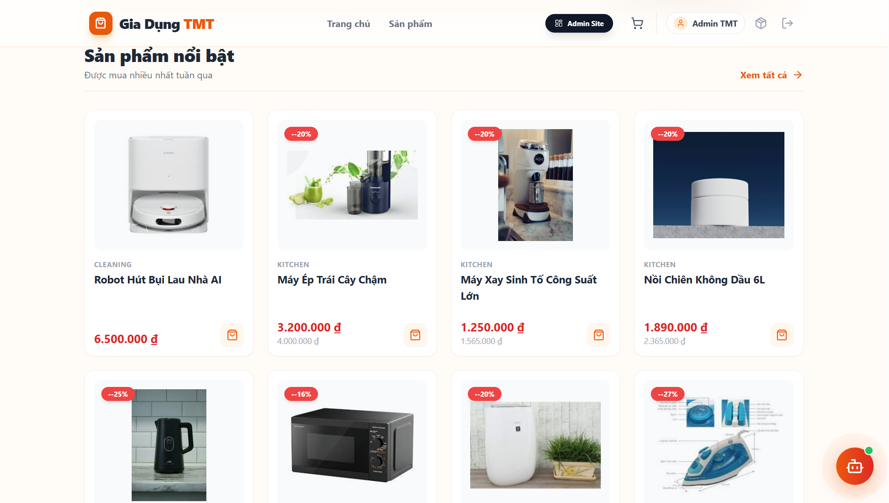
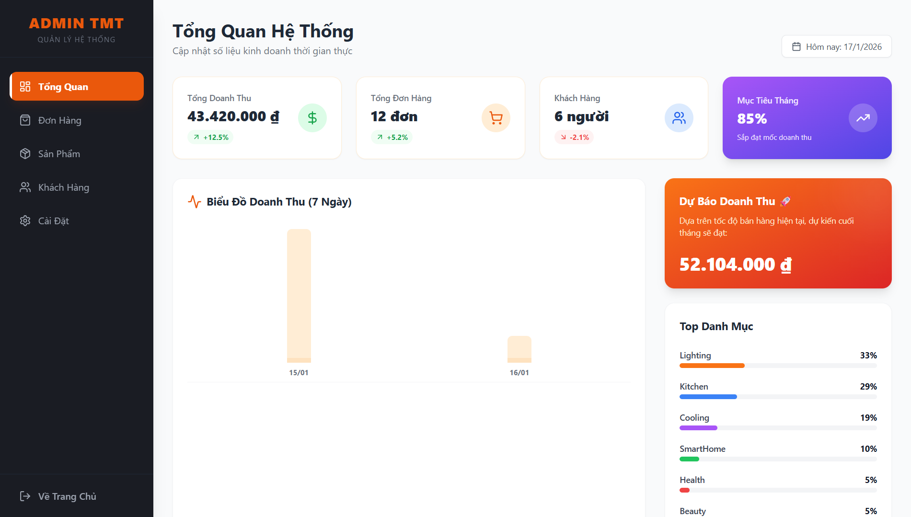
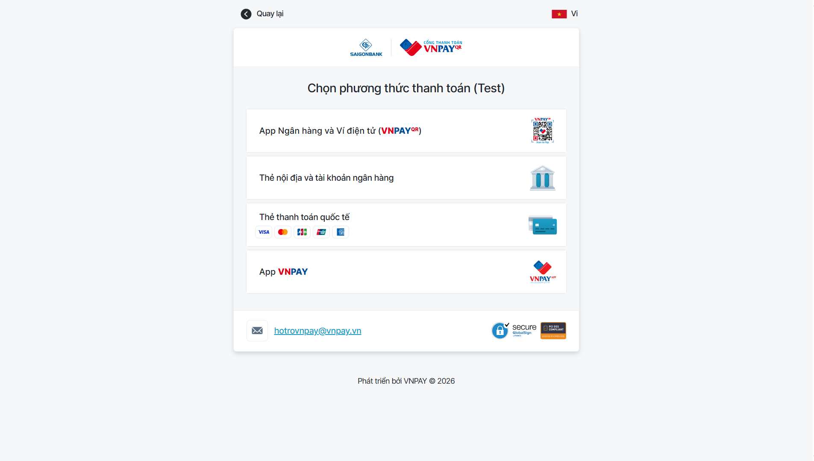

<div align="center">

  

  # 🏠 GIA DỤNG TMT — E-COMMERCE PLATFORM

  **Fullstack E-Commerce với Microservice, Gemini AI Chatbot, Thuật toán CSP, Real-time & VNPay**

  [](https://reactjs.org/)
  [](https://www.typescriptlang.org/)
  [](https://nodejs.org/)
  [](https://expressjs.com/)
  [](https://www.mysql.com/)
  [](https://www.docker.com/)
  [](https://swagger.io/)
  [](https://socket.io/)
  [](https://jestjs.io/)

  [🚀 **Live Demo**](https://dogiadung-vwp8.onrender.com/) · [📖 **API Docs**](https://dogiadungtmt.onrender.com/api-docs) · [🔑 **API Server**](https://dogiadungtmt.onrender.com)

</div>

---

## 📖 Tổng Quan

**Gia Dụng TMT** là hệ thống Thương mại điện tử Fullstack hoàn chỉnh, mô phỏng quy trình vận hành thực tế của doanh nghiệp. Hệ thống tích hợp:

- 🔐 **JWT Authentication** — Xác thực stateless, phân quyền Admin/Customer
- 🤖 **AI Chatbot (Gemini)** — Microservice riêng, phân tích ngôn ngữ tự nhiên, tư vấn 24/7
- 💡 **Thuật toán CSP** — Gợi ý combo bằng Backtracking + Forward Checking
- ⚡ **Real-time** — Socket.IO thông báo đơn hàng mới
- 💳 **VNPay** — Cổng thanh toán trực tuyến
- 📖 **Swagger** — API Documentation chuyên nghiệp

---

## 🔥 Tính Năng Chính

### 🛍️ Khách Hàng
| Tính năng | Mô tả |
|-----------|--------|
| 🛒 Mua sắm | Xem, tìm kiếm, lọc sản phẩm (phân trang) |
| 🤖 AI Chatbot (Gemini) | Phân tích ngôn ngữ tự nhiên, tư vấn thông minh, query DB thật |
| 💡 Gợi ý Combo | Thuật toán CSP tìm combo tối ưu theo ngân sách |
| 💳 Thanh toán | VNPay (ATM/QR), COD |
| 📧 Email tự động | Xác nhận đơn hàng, reset mật khẩu |
| ⭐ Đánh giá | Viết review + upload ảnh |
| 👤 Tài khoản | Đăng ký, đăng nhập, quên mật khẩu, đổi avatar |

### 🛡️ Quản Trị Viên
| Tính năng | Mô tả |
|-----------|--------|
| 📊 Dashboard | Biểu đồ doanh thu, thống kê realtime |
| ⚡ Notification | Socket.IO báo "ting ting" khi có đơn mới |
| 📑 Quản lý | CRUD sản phẩm, đơn hàng, khách hàng |
| 📥 Export | Xuất báo cáo Excel (.xlsx) |
| 🔒 Bảo mật | JWT + Auth Middleware + Input Validation |

---

## 🏗️ Kiến Trúc Hệ Thống

```
📦 dogiadung-main/
├── 📂 src/                     # Frontend (React + TypeScript)
│   ├── pages/                  # Trang: Home, Products, Checkout, Admin...
│   ├── components/             # Components tái sử dụng (ChatBot UI)
│   ├── context/                # AuthContext (JWT)
│   ├── utils/                  # axiosConfig (JWT interceptor)
│   └── layout/                 # Layout chung
├── 📂 server/                  # Backend API (Node.js + Express)
│   ├── config/                 # Database, Logger, Swagger, Multer
│   ├── controllers/            # Business logic (async/await)
│   ├── middleware/              # Auth, Validators, Error Handler
│   ├── routes/                 # API routes (Swagger JSDoc)
│   ├── utils/                  # Email service
│   └── tests/                  # Jest + Supertest (24 test cases)
├── 📂 chatbot-service/         # 🤖 AI Microservice (Gemini 1.5-Flash)
│   ├── config/                 # Gemini AI, Database, Logger
│   ├── controllers/            # Chat handler (intent + response)
│   ├── services/               # Product query service (6 functions)
│   └── Dockerfile
├── 🐳 docker-compose.yml       # Docker (4 services)
├── 🐳 Dockerfile.client        # Frontend container
└── 📋 nginx.conf               # Reverse proxy config
```

---

## 🛠️ Tech Stack

| Layer | Công nghệ |
|-------|-----------|
| **Frontend** | React (Vite), TypeScript, TailwindCSS, Axios, Recharts, Lucide |
| **Backend** | Node.js, Express.js, async/await |
| **AI Chatbot** | Google Gemini 1.5-Flash, Microservice Architecture |
| **Database** | MySQL 8.0 (mysql2 Promise Pool) |
| **Auth** | JWT (jsonwebtoken), bcryptjs, express-validator |
| **Real-time** | Socket.IO (WebSockets) |
| **Security** | Helmet, Rate Limiting, CORS, Input Validation |
| **Logging** | Winston (file + console), Morgan |
| **API Docs** | Swagger (OpenAPI 3.0) |
| **Testing** | Jest, Supertest (24 test cases) |
| **DevOps** | Docker, Docker Compose, Render |
| **Payment** | VNPay SDK |
| **Email** | Nodemailer |

---

## 🔐 Bảo Mật

| Feature | Implementation |
|---------|---------------|
| Authentication | JWT Bearer Token (24h expiry) |
| Password | bcrypt hash (10 rounds salt) |
| Authorization | Role-based middleware (Admin/Customer) |
| Input Validation | express-validator (signup, login, product, order) |
| HTTP Security | Helmet (CSP, XSS, HSTS headers) |
| Rate Limiting | 2000 req / 15 min per IP |
| Error Handling | Centralized middleware, hides stack in production |
| Logging | Winston (error.log + combined.log) |
| Secrets | Environment variables (.env, gitignored) |

---

## 🚀 Cài Đặt & Chạy

### Yêu cầu
- Node.js >= 18
- MySQL 8.0
- Docker (optional)

### Cách 1: Docker (khuyến nghị)

```bash
# 1. Clone project
git clone https://github.com/thanhpino/DoGiaDung.git
cd dogiadung-main

# 2. Tạo file .env
cp server/.env.example server/.env
# Chỉnh sửa các giá trị trong server/.env

# 3. Tạo root .env cho Docker
echo "MYSQL_ROOT_PASSWORD=your_secure_password" > .env

# 4. Build & Run
docker-compose up -d
```

### Cách 2: Manual

```bash
# Backend
cd server
npm install
cp .env.example .env    # Cấu hình biến môi trường
npm run dev             # Chạy trên port 8081

# Frontend (terminal khác)
cd ..
npm install
npm run dev             # Chạy trên port 5173
```

### Biến môi trường (`server/.env`)

```env
# Database
DB_HOST=localhost
DB_USER=root
DB_PASSWORD=your_password
DB_NAME=dogiadung_db
DB_PORT=3306

# Server
PORT=8081
CLIENT_URL=http://localhost:5173

# JWT
JWT_SECRET=your_random_secret_key

# Email (Gmail App Password)
EMAIL_USER=your_email@gmail.com
EMAIL_PASS=your_app_password

# VNPay
VNPAY_TMN_CODE=your_tmn_code
VNPAY_HASH_SECRET=your_secret
VNPAY_URL=https://sandbox.vnpayment.vn/paymentv2/vpcpay.html
VNPAY_RETURN_URL=http://localhost:5173/vnpay-return

# AI Chatbot (Gemini)
GEMINI_API_KEY=your_gemini_api_key
```

---

## 🧪 Testing

```bash
cd server
npm test
```

```
✅ Test Suites: 1 passed, 1 total
✅ Tests:       24 passed, 24 total

Bao gồm:
• Auth: signup, login, token validation, expired token (8 tests)
• Product CRUD: GET, POST, PUT, DELETE + auth check (7 tests)
• Chatbot: greeting, ship info, disambiguation (3 tests)
• Input Validation: name length, email format (2 tests)
• ...và nhiều test khác
```

---

## 📖 API Documentation

Swagger UI có sẵn tại: **[/api-docs](http://localhost:8081/api-docs)**

| Nhóm API | Endpoints |
|----------|-----------|
| 🔐 Auth | `POST /signup`, `POST /login`, `POST /forgot-password`, `POST /reset-password` |
| 🛒 Products | `GET /products`, `GET/POST/PUT/DELETE /api/products` |
| 📦 Orders | `GET/POST /api/orders`, `PUT /api/orders/:id` |
| 👤 Users | `GET /api/users`, `PUT /api/users/:id/password` |
| ⭐ Reviews | `POST /api/reviews`, `GET /api/reviews/:productId` |
| 📊 Stats | `GET /api/stats`, `/api/stats/weekly`, `/api/stats/categories` |
| 🤖 Chatbot | `POST /api/chat` |
| 💡 Suggestion | `POST /api/suggestions/combo` |
| 💳 VNPay | `POST /api/create_payment_url` |

---

## 📸 Screenshots

| 🏠 Trang Chủ | 📊 Admin Dashboard |
|:---:|:---:|
|  |  |

| 💳 Thanh Toán VNPay | 📖 Swagger API Docs |
|:---:|:---:|
|  |  |

---

## 🤖 AI ChatBot — Gemini Microservice

ChatBot sử dụng **Google Gemini 1.5-Flash** để phân tích ngôn ngữ tự nhiên:

```
User: "Mình có 5 triệu, gợi ý đồ cho bếp đi"
    │
    ▼ Gemini AI (Intent Classification)
    intent: "cheap_products", maxPrice: 5000000, category: "Nhà bếp"
    │
    ▼ MySQL Query (sản phẩm thật)
    products: [Nồi chiên 1.2tr, Bếp từ 2.5tr, ...]
    │
    ▼ AI Response Generation
    "Dạ với 5 triệu, em gợi ý combo bếp này cho anh/chị:"
```

**Kiến trúc hybrid:** Microservice (Docker) hoặc In-process (Render)

---

## 💡 Thuật Toán CSP (Combo Suggestion)

Hệ thống sử dụng **CSP Backtracking + Forward Checking** để gợi ý combo sản phẩm tối ưu:

```
Input:  Ngân sách = 5.000.000đ, Danh mục = [Nhà bếp, Phòng khách]
Output: Top 6 combo tối ưu (sát ngân sách nhất)

Thuật toán:
1. Map sản phẩm → domains (theo danh mục)
2. Backtracking: thử từng tổ hợp
3. Forward Checking: cắt nhánh nếu vượt ngân sách
4. Sort: ưu tiên combo sát giá nhất
```

---

## 👨‍💻 Tác Giả

<div align="center">

**Trương Minh Thành**

Software Engineering Student @ Ton Duc Thang University (TDTU)

[](https://github.com/thanhpino)

</div>

<p align="center"> <i>Project for educational purpose. © 2026 Gia Dụng TMT</i> </p>